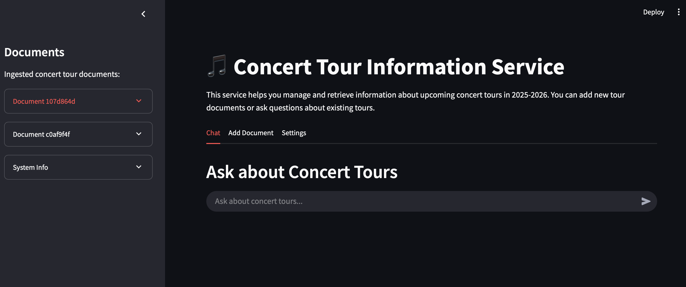
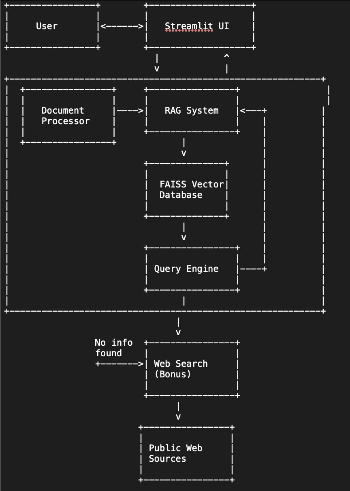

# Concert Tour Information Service

<p align="center">
  
</p>

A Python service that intelligently manages and retrieves information from a collection of domain-specific documents related to upcoming concert tours in 2025-2026.

<p align="center">
  
  
  
</p>

## Quick Start

```bash
# Clone the repository
git clone https://github.com/your-username/concert-tour-service.git
cd concert-tour-service

# Set up environment
python -m venv venv
source venv/bin/activate  # On Windows: venv\Scripts\activate
pip install -r requirements.txt
python -m spacy download en_core_web_sm

# Create .env file with your OpenAI API key
echo "OPENAI_API_KEY=your_key_here" > .env

# Run the Streamlit app
streamlit run streamlit_app.py
```

## Features

- **Document Ingestion**: Analysis, validation, and summarization of concert tour documents
- **Question Answering**: Intelligent responses to queries about concert tours, strictly grounded in the provided documents
- **Web Search (Bonus)**: Fallback to web search when no document information is available
- **Streamlit UI**: User-friendly interface for interacting with the service (optional)

## Architecture

The service is built with the following components:

1. **Document Processor**: Analyzes tour documents, validates relevance, and extracts key information
2. **RAG System**: Stores document embeddings using FAISS and provides semantic retrieval capabilities
3. **Query Engine**: Answers user questions based on the retrieved document information
4. **Web Search Engine (Bonus)**: Retrieves information from public sources when no document data is available
5. **UI**: Streamlit-based interface for easy interaction (optional)

<p align="center">
  
</p>

## Installation

### Prerequisites

- Python 3.9 or higher
- pip (Python package installer)

### Setup

1. Clone the repository:
   ```bash
   git clone https://github.com/your-username/concert-tour-service.git
   cd concert-tour-service
   ```

2. Create a virtual environment:
   ```bash
   python -m venv venv
   ```

3. Activate the virtual environment:
   - On Windows:
     ```bash
     venv\Scripts\activate
     ```
   - On macOS/Linux:
     ```bash
     source venv/bin/activate
     ```

4. Install dependencies:
   ```bash
   pip install -r requirements.txt
   ```

5. Download SpaCy model:
   ```bash
   python -m spacy download en_core_web_sm
   ```

6. Create an `.env` file with your API keys:
   ```
   OPENAI_API_KEY=your_openai_api_key_here
   SERP_API_KEY=your_serpapi_key_here  # Optional, for enhanced web search
   ```

## Usage

### Command-Line Interface

Run the application in command-line mode:

```bash
python main.py
```

This will start the service in interactive mode. You can then:
- Add a document: `Please add this document: [Your concert tour document here]`
- Ask questions: `Where is Lady Gaga planning to give concerts during autumn 2025?`

You can also provide a query directly:

```bash
python main.py --query "Where is Taylor Swift performing in Europe in 2025?"
```

### Streamlit UI (Recommended)

To use the Streamlit interface:

```bash
streamlit run streamlit_app.py
```

This will start the Streamlit server and open the UI in your default web browser.

<p align="center">
  
</p>

## Example Usage

### Adding a Document

```
Please add this document to your database: 
Taylor Swift's "Renaissance World Tour" continues through 2025-2026. The European leg kicks off in Berlin, Germany on March 15, 2025, followed by shows in Paris, France (March 22-23, 2025), London, UK (April 5-8, 2025), and Madrid, Spain (April 15, 2025). The tour then moves to North America with performances in New York (Madison Square Garden, May 10-12, 2025), Los Angeles (SoFi Stadium, May 24-25, 2025), and Toronto (Rogers Centre, June 5, 2025). Special guests include Sabrina Carpenter for all European dates and Gracie Abrams for North American shows.
```

### Asking Questions

- "When is Taylor Swift performing in London?"
- "Which special guests will be joining Taylor Swift in Europe?"
- "What venues will host Taylor Swift in North America?"

### Using Web Search (Bonus Feature)

If you haven't added documents about a particular artist but want information:

- "Where is BTS performing in 2025?"
- "When is Adele's next tour?"
- "What venues will Beyoncé be playing in 2026?"

The system will automatically search public web sources to find and return concert information.

## Project Structure

```
concert_tour_service/
├── app/
│   ├── __init__.py
│   ├── document_processor.py  # Document analysis and summarization
│   ├── rag_system.py          # Vector database and retrieval system
│   ├── query_engine.py        # Question answering logic
│   ├── web_search.py          # Web search functionality (bonus feature)
│   └── utils.py               # Helper functions
├── data/                      # To store document embeddings 
├── tests/                     # Unit tests
├── screenshots/               # UI screenshots and diagrams
├── requirements.txt           # Dependencies
├── main.py                    # Entry point
├── streamlit_app.py           # Streamlit UI
└── README.md                  # Documentation
```

## Approach and Design Choices

### Document Processing

- **Relevance Checking**: Documents are analyzed to ensure they relate to concert tours in 2025-2026
- **Entity Extraction**: SpaCy is used to extract key entities like artists, venues, dates, and locations
- **Summarization**: A concise summary is generated for each document for easy reference

### Information Retrieval

- **Vector Embeddings**: Documents are split into chunks and embedded using SentenceTransformers
- **Semantic Search**: FAISS is used for efficient similarity search to find relevant information
- **Context Building**: Multiple document chunks are combined to provide comprehensive context for answering questions

### Response Generation

- **LLM Integration**: Leverages OpenAI's GPT model to generate natural language responses
- **Grounded Answers**: Responses are strictly grounded in the provided documents, avoiding hallucination
- **Clarity**: Answers are formatted to clearly present tour dates, venues, and other details

## Limitations and Assumptions

This system has a few limitations to be aware of:

1. **Document Format**: The system works best with plain text documents that follow common formatting patterns for concert tour announcements
2. **Time Range**: Currently focused on 2025-2026 tours; documents about past tours may be rejected
3. **Language**: Optimized for English-language documents and queries
4. **Web Search Reliability**: The web search feature provides best-effort results but may not always find complete or up-to-date information
5. **API Dependency**: Requires an OpenAI API key for question answering functionality

## Troubleshooting

### Common Issues

- **Document Not Accepted**: Ensure your document mentions concert tours in 2025-2026 and contains at least 3 concert-related keywords
- **Missing API Key**: Check that your `.env` file contains a valid OpenAI API key
- **Web Search Not Working**: Verify web search is enabled in the Settings tab (Streamlit UI)
- **Slow Response Time**: Complex questions or large documents may take longer to process

### Debug Mode

To run in debug mode with additional logging:

```bash
streamlit run streamlit_app.py -- --debug
```

## License

[MIT License](LICENSE)
